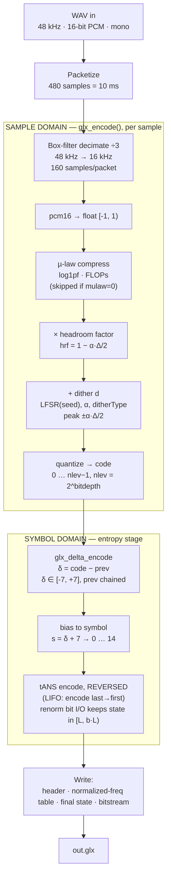
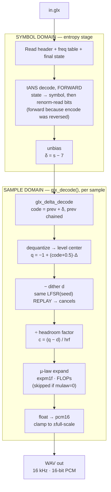
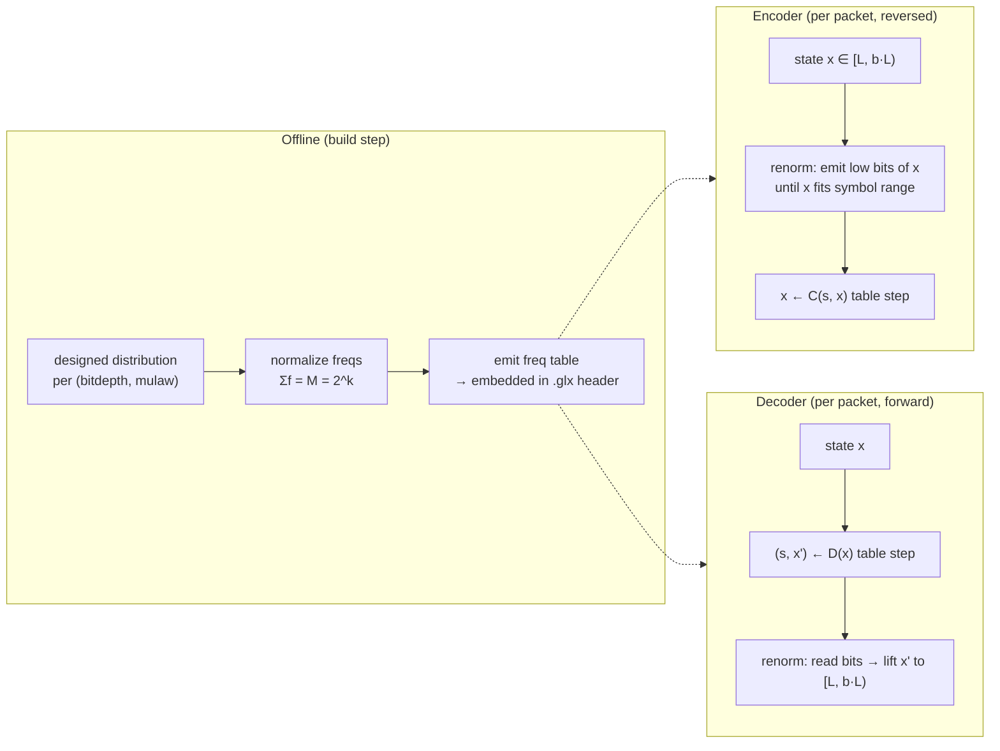

# GLX Codec — Optimal Block Layout

Target design for the `.glx` speech codec: **48 kHz → 16 kHz, µ-law (optional) → dithered
quantizer → delta → tANS entropy coder**. This document captures the *optimal* pipeline —
i.e. the current design with the entropy stage moved from canonical Huffman to **tANS** — and
pins down the stage ordering and the invariants that keep encode/decode exactly reversible.

The key correctness idea: the pipeline is two **independent domains** stacked in series.
The **sample domain** (companding, headroom, dither, quantize) and the **symbol domain**
(delta, entropy code) never overlap. The entropy coder never sees dither; the dither logic
never sees an entropy symbol.

---

## 1. Encode path



### Why the stage order is what it is
- **µ-law before headroom/dither** — companding must act on the true signal; the quantizer
  operates in the companded domain.
- **Headroom before dither** — `hrf` reserves exactly `±α·Δ/2` so the *dithered, full-scale*
  sample lands on the quantizer rail without saturating (`hrf = 1 − α·Δ/2`). For `α ≤ 0.5`
  this maps the decode round-trip exactly into `[-1, 1]` with no clip.
- **Delta before entropy** — the delta transform (`prev` chained across packets) is
  independent of entropy-coding order, so it stays forward even though tANS encodes reversed.

---

## 2. Decode path (mirror image)



### The reversibility contract
| Encode step | Decode step | Cancels because |
|---|---|---|
| `+ dither d` | `− dither d` | identical LFSR seed + fixed draw order → same `d` on both sides |
| `× hrf` | `÷ hrf` | `hrf` derived from same `α`, `bitdepth` |
| µ-law compress | µ-law expand | exact analytic inverse (`log1pf` ↔ `expm1f`) |
| quantize | dequantize | lossy — the *only* intended information loss |

---

## 3. Entropy stage detail — tANS (the "optimal" change)

Replaces canonical Huffman. Motivated by the **peaky** delta distribution: `δ = 0` dominates,
so Huffman's integer-length floor wastes a full bit where the ideal is `−log₂P(0) < 1` bit.
tANS recovers those fractional bits.



**Design choices that make tANS cheap here**
- **Alphabet = 15 symbols** (δ ∈ [-7,7]) → tables at `M = 1024–4096` are tiny and cache-resident.
- **Static, designed distributions** — same input as today's `build_huffman.py`, emitted as
  normalized frequencies instead of code lengths. No adaptive modeling.
- **Self-describing** — the freq table rides in the header (≈23–30 bytes), so the decoder
  needs no compiled-in table, exactly like today's 8-byte length block.

**The one structural cost: ANS is LIFO.** Decode recovers symbols in reverse of encode order,
so the encoder buffers a packet's 160 deltas and encodes them **last→first**; the decoder then
reads **forward**. Recommended granularity: **per-packet ANS blocks** (flush final state each
10 ms packet) to preserve the streaming packet model and truncation recovery.

---

## 4. Wire format (`.glx`)

```
┌──────────────────────────────────────────────────────────────┐
│ Header (21 B, little-endian)                                   │
│   magic "GLX1" · sampleRate(16000) · bitsPerSym · alphaIdx     │
│   · mulaw · huff/entropy-mode · ditherType · seed · numPackets │
├──────────────────────────────────────────────────────────────┤
│ Entropy table block (self-describing)                          │
│   Huffman:  8 B packed code-lengths     (current)              │
│   tANS:    ~23–30 B normalized freqs    (optimal)             │
├──────────────────────────────────────────────────────────────┤
│ Payload                                                        │
│   per-packet entropy-coded delta symbols (+ ANS final state)   │
└──────────────────────────────────────────────────────────────┘
```

---

## 5. Fixed design parameters (from `glx.h`)

| Constant | Value | Meaning |
|---|---|---|
| `GLX_IN_RATE` | 48000 | input rate — **48 kHz only** by design |
| `GLX_OUT_RATE` | 16000 | output rate after decimation |
| `GLX_DECIMATION` | 3 | 48 → 16 kHz box-filter decimate |
| `GLX_FRAMES_PER_PACKET` | 160 | 10 ms packet at 16 kHz |
| `GLX_BITS_MIN … MAX` | 1 … 3 | quantizer bit depth |
| `GLX_MU` | 255 | µ-law µ |
| `GLX_HUFF_NSYM` | 15 | delta alphabet size (δ ∈ [-7,7]) |
| `hrf` | `1 − α·Δ/2` | headroom; no round-trip clip when `α ≤ 0.5` |

> **Note:** "normalization" (Σf = M) and "renormalization" (state bit-I/O) are both entirely
> inside the **symbol-domain** entropy stage. They are upstream of — and independent from — the
> sample-domain dither subtraction in `glx_decode`. The entropy coder never sees dither.
