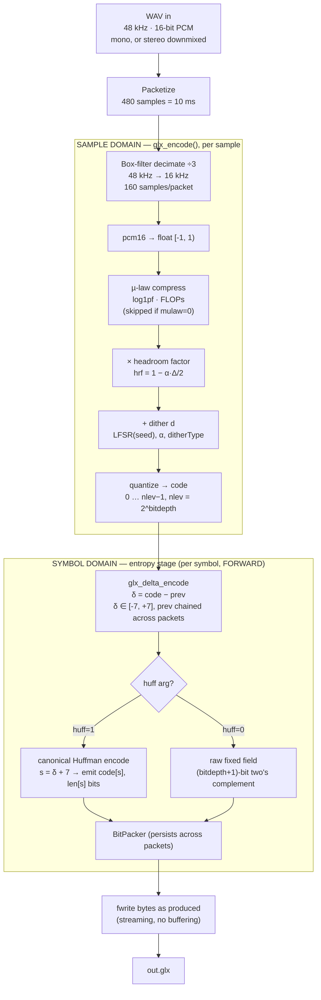
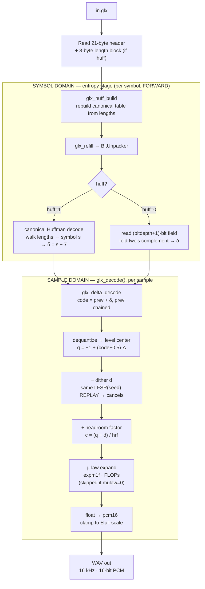
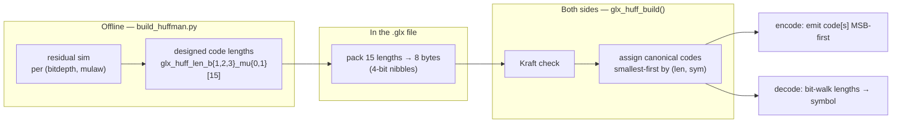

# GLX Codec — Current Block Layout (as-built)

The codec **as it is implemented today**. Companion to [CODEC_LAYOUT.md](CODEC_LAYOUT.md)
(the optimal/target tANS design). The sample-domain half is identical; the differences are
all in the **entropy stage** and the **streaming model**:

- Entropy coder is **canonical Huffman** (not tANS), selectable against a **raw fixed-width**
  fallback via the `huff` CLI arg.
- Coding is **forward and streaming** — each symbol's bits are emitted and `fwrite`-n as it is
  produced; no buffering, no reverse-order pass (Huffman is order-symmetric, so decode reads
  forward too).
- All state (LFSR, delta predictor, bit packer) **persists across packets** → one seamless
  stream, not per-packet blocks.
- Self-describing table is an **8-byte packed code-length block**.

---

## 1. Encode path (current)



### Current streaming model
- The `BitPacker`, dither `LFSR`, and delta `prev` are all initialized **once** and carried
  across every packet, so the bitstream is continuous with no per-packet framing.
- Bytes are flushed to disk **as each symbol is coded** — the encoder never holds more than a
  packet in RAM.
- Truncation recovery: if the input ends early, the header's `numPackets` is patched via a
  saved file offset (`fseek` back and rewrite).

---

## 2. Decode path (current, mirror image)



The reversibility contract (dither replay, `hrf`, µ-law inverse; quantize is the only lossy
step) is **identical** to the target design — see [CODEC_LAYOUT.md](CODEC_LAYOUT.md) §2.

---

## 3. Entropy stage detail — canonical Huffman (current)



**Characteristics of the current entropy stage**
- **15-symbol alphabet** (δ ∈ [-7,7], symbol = δ + 7). Outer symbols simply never occur at
  low bit depth; the table stays 15 wide so the block is a fixed 8 bytes at every depth.
- **Self-describing** — 8-byte packed length block after the header; decoder rebuilds the
  canonical table with `glx_huff_build` (Kraft-validated).
- **Forward & symmetric** — encode and decode both proceed left-to-right; no buffering,
  no reverse pass, no per-packet state flush.
- **Known inefficiency** — integer code lengths waste fractional bits on the peaky delta
  distribution (`δ = 0` gets 1 bit even when `−log₂P(0) < 1`). This is exactly the gap the
  tANS target design closes.

**Expected cost (bits/symbol, from the generated table header):**

| bitdepth | mu-law on | mu-law off |
|---|---|---|
| 1 | 1.338 | 1.538 |
| 2 | 1.426 | 1.488 |
| 3 | 1.624 | 1.458 |

---

## 4. Wire format (current `.glx`)

```
┌──────────────────────────────────────────────────────────────┐
│ Header (21 B, little-endian)                                   │
│   magic "GLX1" · sampleRate(16000) · bitsPerSym · alphaIdx     │
│   · mulaw · huff · ditherType · seed · numPackets              │
├──────────────────────────────────────────────────────────────┤
│ Huffman length block  — 8 B, ONLY present when huff=1          │
├──────────────────────────────────────────────────────────────┤
│ Payload                                                        │
│   one continuous forward bitstream of delta symbols            │
│   (huff: canonical codes · raw: (bitdepth+1)-bit fields)       │
└──────────────────────────────────────────────────────────────┘
```

---

## 5. CLI (current)

```
./encoder  in.wav  alpha  seed  bitdepth  dither  out.glx  huff  mulaw
              1      2      3       4        5       6       7     8
```

| arg | field | values |
|---|---|---|
| alpha | `alphaIdx` | 1→0.0 … 11→1.0 |
| seed | LFSR seed | non-zero |
| bitdepth | `bitsPerSym` | 1 … 3 |
| dither | `ditherType` | 1 = masked RPDF, 2 = spiked |
| huff | `huff` | 1 = Huffman, 0 = raw fixed-width |
| mulaw | `mulaw` | 1 = µ-law, 0 = linear |

> ⚠️ **Known bug (current):** `encoder.c` reads `int mulaw = argv[8];` — assigning the
> `char*` pointer instead of `atoi(argv[8])`. As written, `mulaw` is never 0 or 1, so the
> validation rejects every invocation with *"Mu Law needs to be defined"*. Fix: `atoi(argv[8])`.

---

## What changes on the way to the optimal design

| Aspect | Current (this doc) | Optimal ([CODEC_LAYOUT.md](CODEC_LAYOUT.md)) |
|---|---|---|
| Entropy coder | canonical Huffman | tANS |
| Fractional-bit efficiency | integer-length floor (lossy on peak) | near-entropy |
| Coding order | forward, streaming, per-symbol write | reversed encode / forward decode (LIFO) |
| Packet model | one seamless cross-packet stream | per-packet ANS blocks + final state |
| Self-describing table | 8-byte code lengths | ~23–30-byte normalized freqs |
| Sample-domain pipeline | *(unchanged)* | *(unchanged)* |
